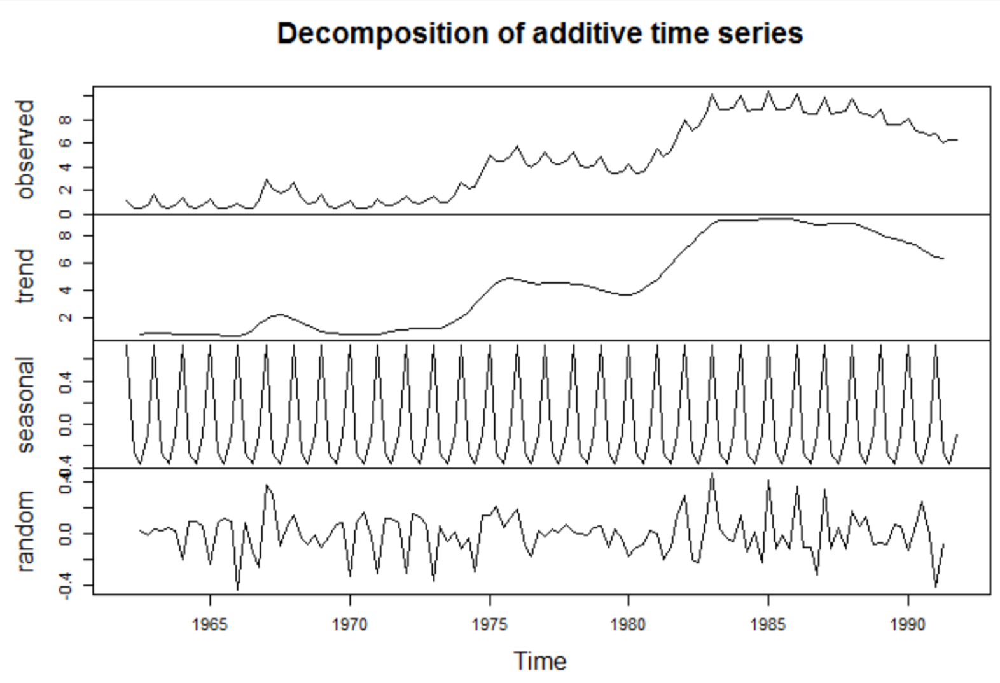
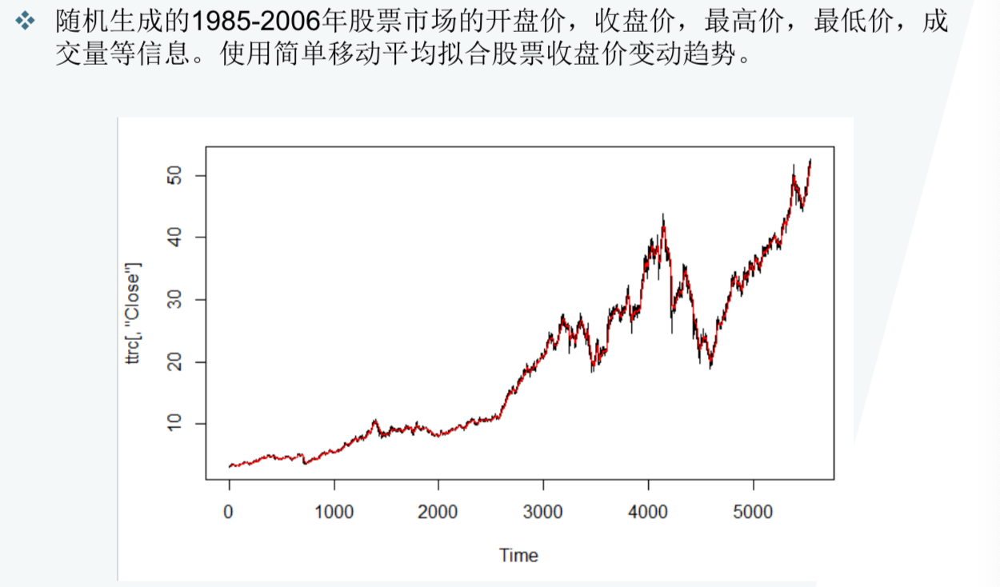
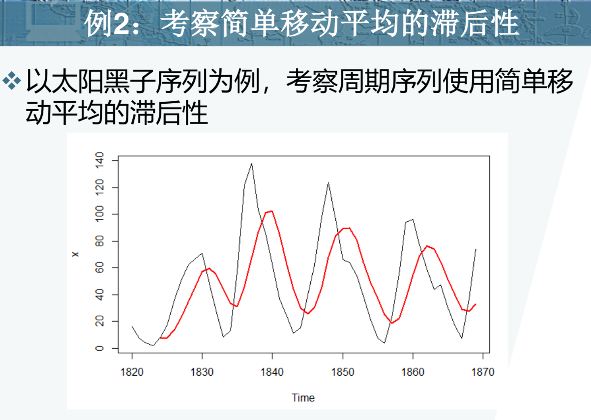
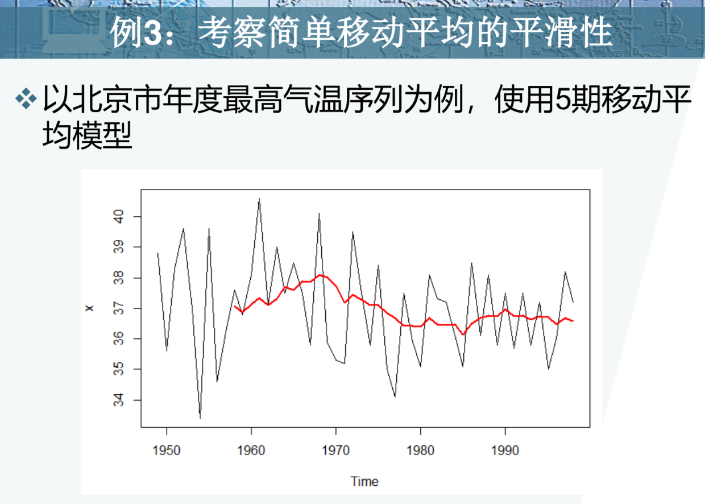
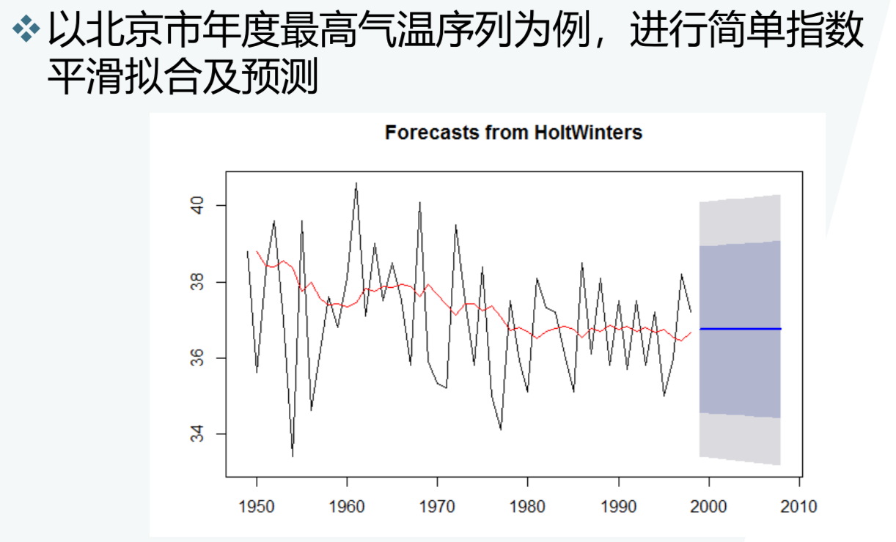
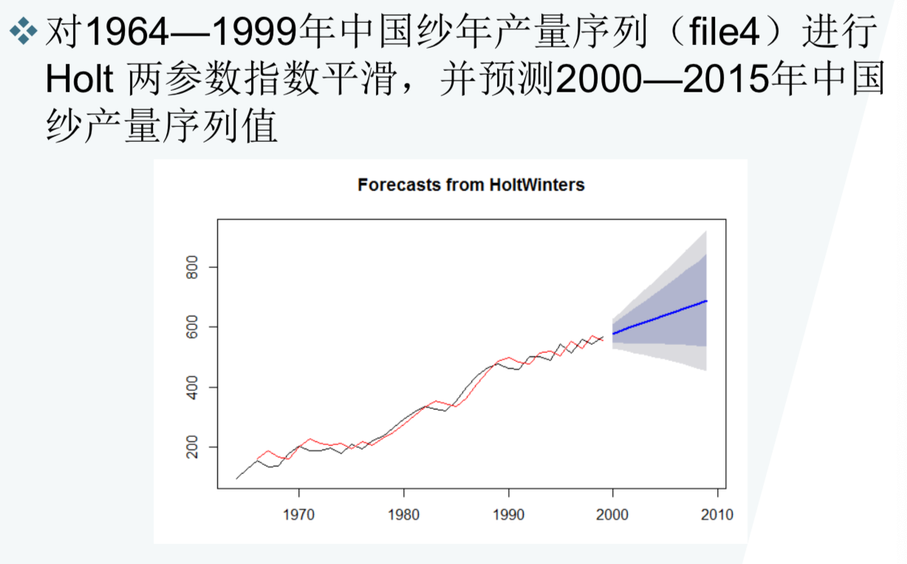
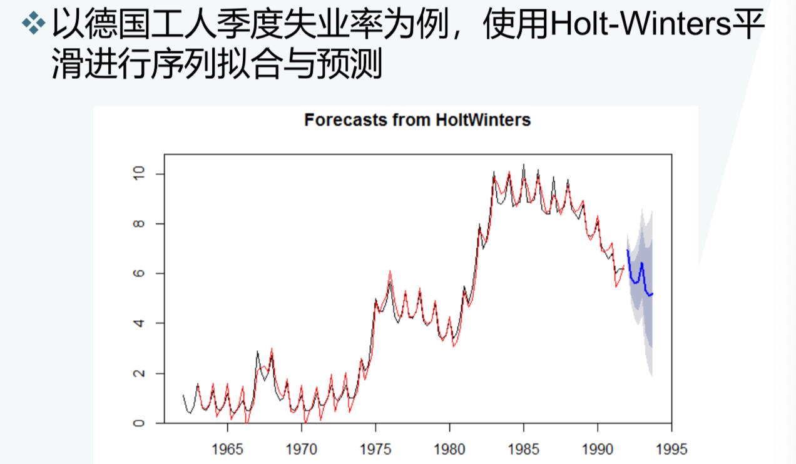
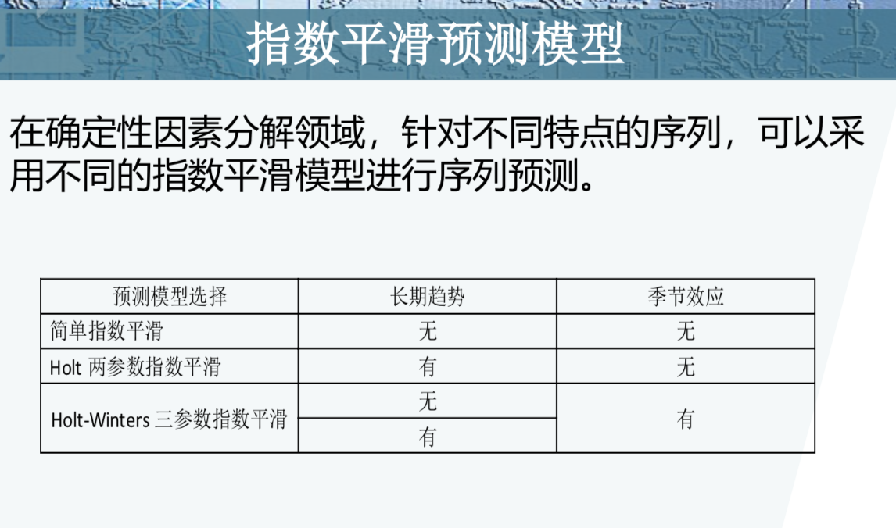

**非平稳序列的确定性分析**

**确定性因素分解**

* 因素分解方法(Time Series Decomposition) 
* 因素分解方法认为所有的序列波动都可以归纳到受到如下四类因素的综合影响
  * 长期趋势(Trend):序列呈现出明显的长期递增或递减的变化趋势
  * 循环波动(Circle):序列呈现出从低到高再由高到低的反复循环波动，循环周期可长可短，不一定是固定的
  * 季节性变化(Season)：序列呈现出和季节变化相关的稳定周期波动
  * 随机波动(Immediate)：除了长期趋势，循环波动和季节性变化之外，其他不能用确定性因素解释的序列波动，都属于随机波动

**确定性时序分析的目的**

* 一是克服其他因素的干扰，单纯测度出某个确定性因素(诸如季节，趋势，交易日）对序列的影响
* 二是根据序列呈现的确定性特征，选择适当的方法对序列进行综合预测

**常用模型**

* 加法模型：$x_{t}=T_{t}+C_{t}+S_{t}+I_{t}$
* 乘法模型：$x_{t}=T_{t} \times C_{t} \times S_{t} \times I_{t}$

**因素分解模型遇到的问题**

* 如果观察时期不是足够长，那么循环因素和趋势因素的影响很难准确区分
* 有些社会现象和经济现象显示出某些特殊日期是一个很显著的影响因素，但是在传统因素分解模型中，它并没有被纳入研究

**因素分解改进模型**

* 如果观察时期不是足够长，人们将循环因素Circle改为特殊交易日因素Day，新的四大因素为
  * 趋势 T
  * 季节 S
  * 交易日 D
  * 随机波动 I
* 加法模型：$x_{t}=T_{t}+S_{t}+D_{t}+I_{t}$
* 乘法模型：$x_{t}=T_{t} \times S_{t} \times D_{t} \times I_{t}$
* 对数加法模型：$\log x_{t}=\log T_{t}+\log S_{t}+\log D_{t}+\log I_{t}$

**德国工人失业率序列确定性因素分解**

**确定性因素预测：平滑法**

任何一个时间序列$\left\{x_{t}\right\}$  都可以分解为两部门的叠加：其中一部分是由多项式决定的确定性趋势成分，另一部分是平稳的零均值误差成分即

$x_t = \mu_t + \epsilon_t$

其中：$\mu_t$ 为确定性影响，$\epsilon_t$ 为随机性影响

**平滑预测模型**

* 确定性因素分析的一个主要目的实时根据序列呈现的确定性特征，选择适当的模型，预测序列未来的发展。
* 平滑法是利用修匀技术，削弱短期随机波动对序列的影响，使序列平滑化，从而显示出变化规律。它具有调节灵活、计算简便的特征
* 平滑法根据所用的平滑技术的不同可以分为移动平均法和指数平滑法

**移动平均法**

* 对于一个时间序列，序列在一个比较短的时间间隔内，序列的取值是比较稳定的，序列值之间的差异主要是由随机波动造成的。根据这种假定，我们可以用最近一段时间内的平均值作为未来几期的预测值，该方法成为简单移动平均预测法

* 假定最后一期的观察值为$x_t$,那么使用简单移动平均模型，向前预测l期，各期的预测值为

  $\hat{x}_{t+1}=\frac{x_{t}+x_{t-1}+\cdots+x_{t-n+1}}{n}$
  $\hat{x}_{t+2}=\frac{\hat{x}_{t+1}+x_{t}+x_{t-1}+\cdots+x_{t-n+2}}{n}$
  $\hat{x}_{t+l}=\frac{\hat{x}_{t+l-1}+\cdots+\hat{x}_{t+1}+x_{t}+\cdots+x_{t-n+l}}{n}$

**移动平均的期数如何确定**

* 事件的发展有无周期性
* 对趋势平滑性的要求
* 对近期敏感程度的要求

**举例**

例1:简单移动平均在股票交易市场的应用

**移动平均有滞后性**

**移动平均具有平滑性**

**简单指数平滑预测模型**

* 简单移动平均法实际上就是用一个简单的加权平均数作为某一期序列值的估计值。实际上也就是假定无论时间的远近，这n期的观察值对预测值的影响力都是一样的。但在实际生活中，我们会发现对大多数随机事件而言，一般都是近期的结果对现在的影响会大些，远期的结果对现在的影响会小些。

* 为了更好的反应这种时间所起的影响作用，我们将考虑到时间间隔对事件发展的影响，各期权重随时间间隔的增大而指数衰减。

* 简单指数平滑模型

  $\tilde{X}_{t}=\alpha X_{t}+\alpha(1-\alpha) X_{t-1}+\alpha(1-\alpha)^{2} X_{t-2}+\cdots$

* 等价模型

  $\tilde{X}_{t}=\alpha X_{t}+(1-\alpha) \tilde{X}_{t-1}$

**简单指数平滑**

* 简单指数平滑面临一个确定初始值的问题，最简单的方法，指定： $\tilde{X}_{0}=X_{1}$
* 平滑系数$\alpha$的值最初由研究人员根据经验给出。一般对于变化缓慢的序列，$\alpha$常取较小的值，相反对于变化迅速的序列，$\alpha$常取较大的值。经验值通常介于0.05至0.3之间

**举例说明**

**holt两参数指数平滑**

* holt两参数指数平滑适合用于对含有线性趋势的序列进行修匀。它的基本思想是假定序列有一个比较固定的线性趋势——每期都递减r 或者 递增r，那么第t期的估计值就应该等于第 t-1期的观察值加上每期固定的趋势变动值，即$\hat{x}_{t}=x_{t-1}+r$
* 但是由于随机因素的影响，使得每期的递增或递减值不会恒定为r，它会随时间变化上下波动，所以趋势序列实际上是一个随机序列，因此$\hat{x}_{t}=x_{t-1}+r_{t-1}$

**Holt参数指数平滑公式**

* 公式：

  $\tilde{X}_{t}=\alpha X_{t}+(1-\alpha)\left(\tilde{X}_{t-1}+r_{t-1}\right)$
  $r_{t}=\beta\left(\tilde{X}_{t}-\tilde{X}_{t-1}\right)+(1-\beta) r_{t-1}$

* 平滑序列的初始值，最简单的指定 $\tilde{X}_{0}=X_{1}$

* 趋势序列的初始值，最简单的方法是：任意指定一个区间长度，用这段区间的平均趋势作为趋势初始值$r_{0}=\frac{x_{n+1}-x_{1}}{n}$

* 使用Holt两参数指数平滑法，向前l 期的预测值 $\hat{X}_{T}(l)=\tilde{X}_{T}+l r_{T}$

  

**Holt-Winters三参数指数平滑**

* 为了修匀引入季节效应的序列，Winters在Holt两参数指数平滑的基础上构造了Holt-WInters三参数指数平滑

* Holt-Winters三参数指数平滑公式(加法模型)

  $\begin{aligned} \tilde{X}_{t}=& \alpha\left(X_{t}-S_{t-p}\right)+(1-\alpha)\left(\tilde{X}_{t-1}+r_{t-1}\right) \\ r_{t}=& \beta\left(\tilde{X}_{t}-\tilde{X}_{t-1}\right)+(1-\beta) r_{t-1} \\ S_{t}=& \gamma\left(X_{t}-\tilde{X}_{t}\right)+(1-\gamma) S_{t-p} \end{aligned}$

* 进行预测的公式：

  $\hat{X}_{T}(l)=\tilde{X}_{T}+l r_{T}+S_{t-p+l}$

**乘法模型**

$\begin{aligned} \tilde{X}_{t}=& \alpha\left(X_{t} / S_{t-p}\right)+(1-\alpha)\left(\tilde{X}_{t-1}+r_{t-1}\right) \end{aligned}$

$r_{t}= \beta (\tilde{X}_{t}-\tilde{X}_{t-1})+(1-\beta) r_{t-1}$

$ S_{t}=\gamma\left(X_{t} / \tilde{X}_{t}\right)+(1-\gamma) S_{t-p}$

进行预测的公式：$\hat{X}_{T}(l)=\left(\tilde{X}_{T}+l r_{T}\right) * S_{t-p+l}$

如果每个12月都比每个11月多卖出1000套公寓，我们就说这样的季节趋势是“累加性”的。可以用绝对增长来表示。如果我们在夏季比冬季多卖出10%的公寓，那么季节趋势在自然中是“累乘性”的。

 

