**AR模型定义**

具有如下结构的模型称为*p* 阶自回归模型，记为*AR*(*p*)

$\left\{\begin{array}{l}{x_{t}=\phi_{0}+\phi_{1} x_{t-1}+\phi_{2} x_{t-2}+\Lambda+\phi_{p} x_{t-p}+\varepsilon_{t}} \\ {\phi_{p} \neq 0} \\ {E\left(\varepsilon_{t}\right)=0, \quad \operatorname{Var}\left(\varepsilon_{t}\right)=\sigma_{\varepsilon}^{2}, E\left(\varepsilon_{t} \varepsilon_{s}\right)=0, s \neq t} \\ {E x_{s} \varepsilon_{t}=0, \forall s<t}\end{array}\right.$

**当$\phi_0 = 0$ 时，成为中心化AR(p)模型**

称${y_t}$ 为 ${x_t}$ 的中心化序列，令

$\mu=\frac{\phi_{0}}{1-\phi_{1}-\Lambda-\phi_{p}}$
$y_{t}=x_{t}-\mu$

**AR模型平稳性判别**

* 判别原因
  * AR模型是常用的平稳序列的拟合模型之一，但并非所有的AR模型都是平稳的
* 判别方法
  * 单位根判别法：p个特征根都在单位圆内
  * 平稳域判别法：$\left\{\phi_{1}, \phi_{2}, \mathrm{L}, \phi_{p}\right.| $} 特征根都在单位圆内

**AR(1)模型平稳条件**

* 方程结构：$x_{t}=\phi x_{t}+\varepsilon_{t}$
* 特征根 ：$\lambda=\phi$
* 平稳域：$|\phi|<1$

**AR(2)模型平稳条件**

* 方程结构：$x_{t}=\phi_{1} x_{t-1}+\phi_{2} x_{t-2}+\varepsilon_{t}$

* 特征根：$\lambda_{1}=\frac{\phi_{1}+\sqrt{\phi_{1}^{2}+4 \phi_{2}}}{2} \quad \lambda_{2}=\frac{\phi_{1}-\sqrt{\phi_{1}^{2}+4 \phi_{2}}}{2}$

* 平稳域：

   (1) $\left|\phi_{2}\right|=\left|\lambda_{1} \lambda_{2}\right|<1$
  $(2) \phi_{2}+\phi_{1}=-\lambda_{1} \lambda_{2}+\lambda_{1}+\lambda_{2}=1-\left(1-\lambda_{1}\right)\left(1-\lambda_{2}\right)<1$
  $(3) \phi_{2}-\phi_{1}=-\lambda_{1} \lambda_{2}-\lambda_{1}-\lambda_{2}=1-\left(1+\lambda_{1}\right)\left(1+\lambda_{2}\right)<1$
  $\Rightarrow\left\{\phi_{1}, \phi_{2}|| \phi_{2} |<1, \quad \exists \phi_{2} \pm \phi_{1}<1\right\}$

**举例说明**

(1) $x_{t}=0.8 x_{t-1}+\varepsilon_{t}$
(2) $x_{t}=-1.1 x_{t-1}+\varepsilon_{t}$
(3) $x_{t}=x_{t-1}-0.5 x_{t-2}+\varepsilon_{t}$
(4) $x_{t}=x_{t-1}+0.5 x_{t-2}+\varepsilon_{t}$

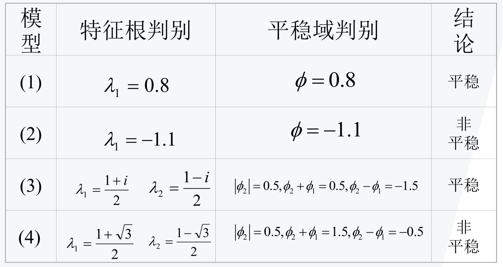

**各个方程对应时序图**

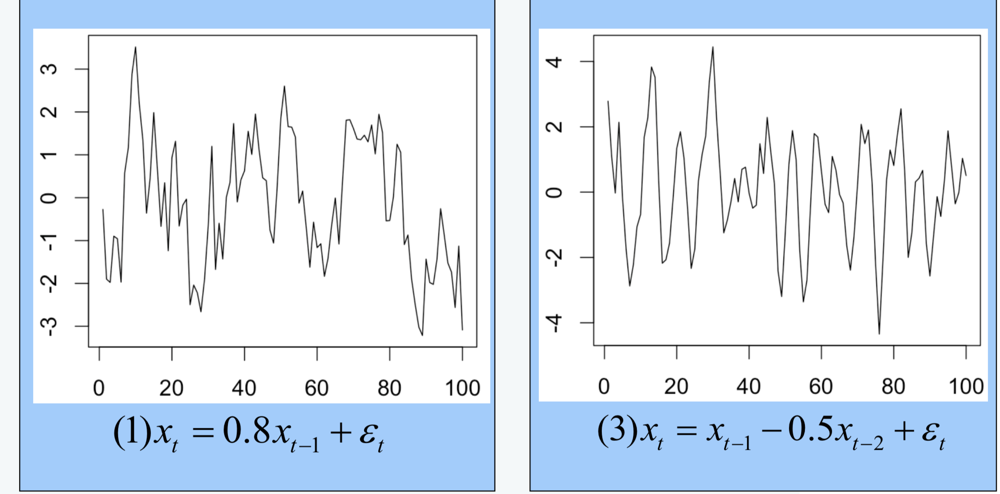

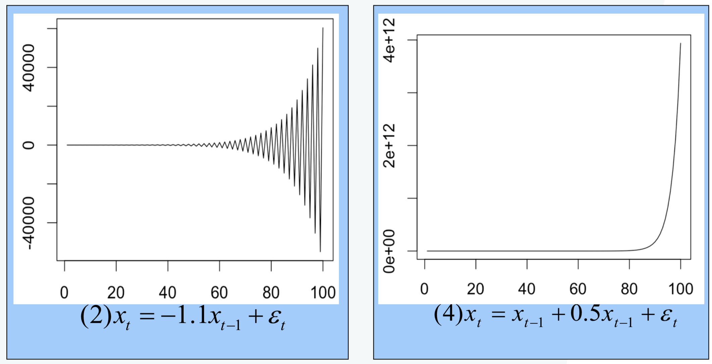

### AR模型的统计性质

**AR(1)模型**

* 平稳AR(1)模型的协方差:$\gamma_{0}=\frac{\sigma_{\varepsilon}^{2}}{1-\phi_{1}^{2}}$
* 协方差函数的递推公式为:$\gamma_{k}=\phi_{1}^{k} \frac{\sigma_{\varepsilon}^{2}}{1-\phi_{1}^{2}}$

**AR(2)模型**

* 协方差函数递推公式：

  $\left\{\begin{array}{l}{\gamma_{0}=\frac{1-\phi_{2}}{\left(1+\phi_{2}\right)\left(1-\phi_{1}-\phi_{2}\right)\left(1+\phi_{1}-\phi_{2}\right)} \sigma_{\varepsilon}^{2}} \\ {\gamma_{1}=\frac{\phi_{1} \gamma_{0}}{1-\phi_{2}}} \\ {\gamma_{k}=\phi_{1} \gamma_{k-1}+\phi_{2} \gamma_{k-2}, \quad k \geq 2}\end{array}\right.$

**平稳AR(p)模型**

* 在平稳AR(P)模型两边同乘$\mathcal{X}_{t-k}$，再求期望$E\left(x_{t} x_{t-k}\right)=\phi_{1} E\left(x_{t-1} x_{t-k}\right)+\Lambda+\phi_{p} E\left(x_{t-p} x_{t-k}\right)+E\left(\varepsilon_{t} x_{t-k}\right)$
* 根据$E\left(\varepsilon_{t} x_{t-k}\right)=0$
* 得协方差函数的递推公式 $\gamma_{k}=\phi_{1} \gamma_{k-1}+\phi_{2} \gamma_{k-2}+\Lambda+\phi_{p} \gamma_{k-p}, \forall k \geq 1$

**自相关系数**

* 定义：$\rho_{k}=\frac{\gamma_{k}}{\gamma_{0}}$
* 平稳AR(P)模型的自相关系数递推公式$\rho_{k}=\phi_{1} \rho_{k-1}+\phi_{2} \rho_{k-2}+\mathrm{L}+\phi_{p} \rho_{k-p}$

**自相关系数性质**

* 拖尾性：说明自相关系数始终有非零取值，不会在某个k之后的所有系数都为0
* 呈指数衰减：这个性质体现了平稳序列的短期相关性，它寿命对于平稳时间序列而言，通常只有近期的序列值对当前值得影响比较明显

**举例说明**

(1) $x_{t}=0.8 x_{t-1}+\varepsilon_{t}$

自相关系数按复指数单调收敛到零

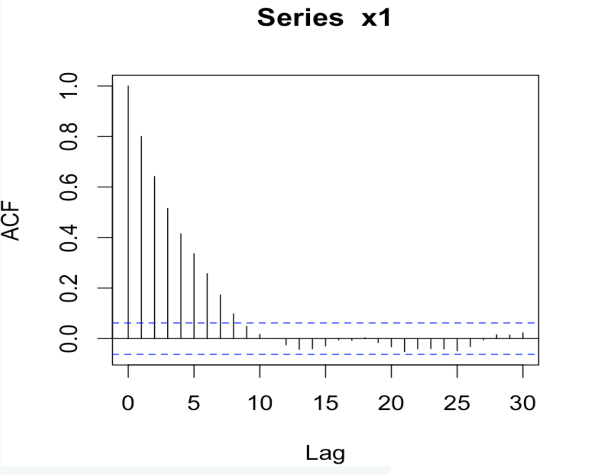

(2) $x_{t}=-0.8 x_{t-1}+\varepsilon_{t}$

自相关系数呈正负相间衰减

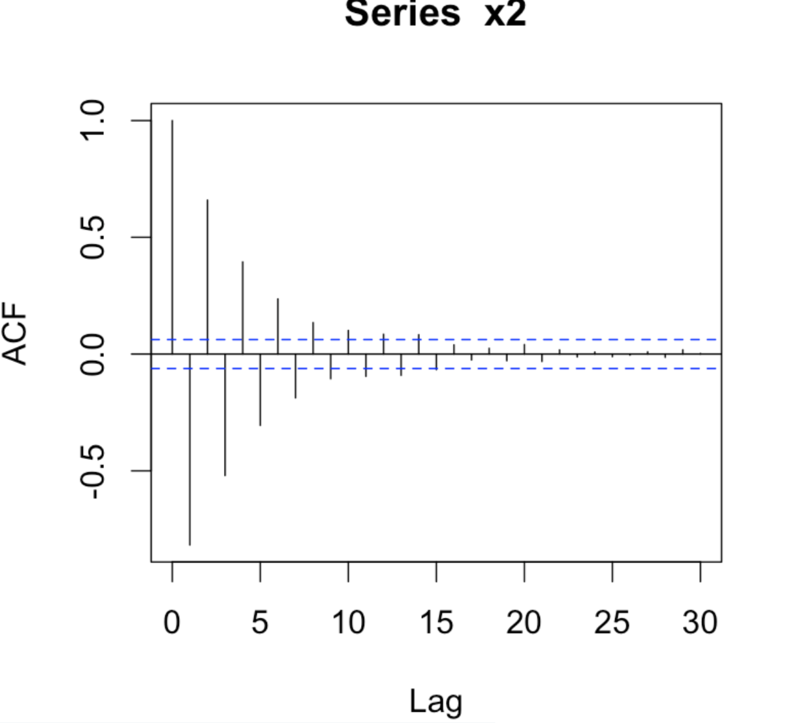

(3) $x_{t}=x_{t-1}-0.5 x_{t-2}+\varepsilon_{t}$

自相关系数呈现出“伪周期”性

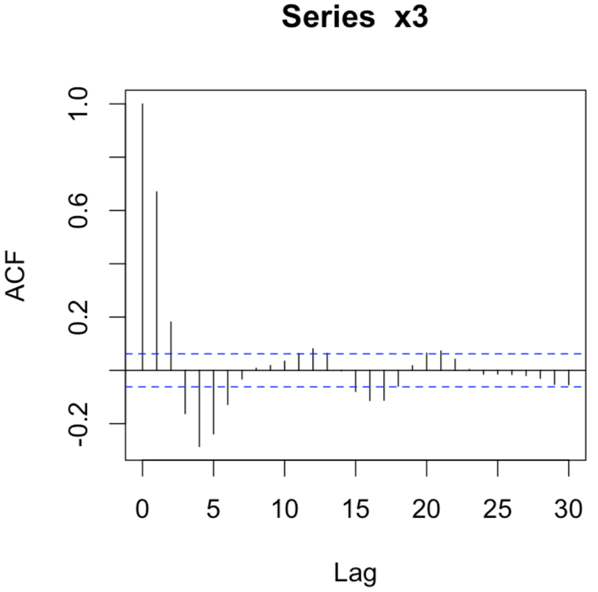

(4) $x_{t}=-x_{t-1}-0.5 x_{t-2}+\varepsilon_{t}$

自相关系数不规则衰减

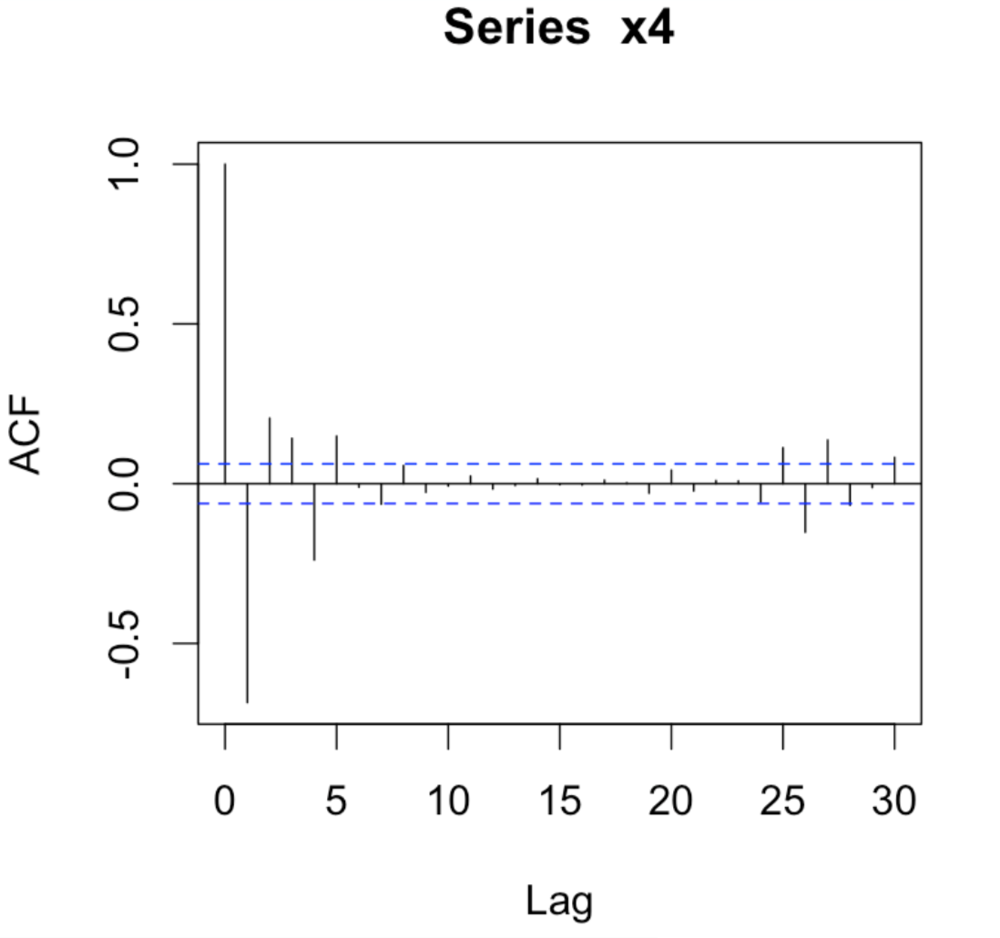

### AR模型阶数判定

定义 ：对于平稳*AR*(*p*) 序列，所谓滞后k偏自相关系数就是指在给定中间k-1个随机变量 $x_{t-1}, x_{t-2}, \Lambda, x_{t-k+1}$ 的条件下，或者说，在剔除了中间k-1个随机变 量的干扰之后，$x_{t-k}$对$x_{t}$ 影响的相关度量。用数 学语言描述就是

$\rho_{x_{i}, x_{i-k} | x_{i-1}, \Lambda_{i-k+1}}=\frac{E\left[\left(x_{t}-\hat{E} x_{t}\right)\left(x_{t-k}-\hat{E} x_{t-k}\right)\right]}{E\left[\left(x_{t-k}-\hat{E} x_{t-k}\right)^{2}\right.}$

其中  $ \hat{E} x_{t}=E\left[x_{t} | x_{t-1}, \mathrm{L}, x_{t-k+1}\right], \hat{E} x_{t-k}=E\left[x_{t-k} | x_{t-1}, \mathrm{L}, x_{t-k+1}\right]$

**偏自相关系数和回归分析中的偏相关系数有相似的关系**

用过去k期的序列值对$x_t$ 做 k阶自回归拟合

$x_{t}=\phi_{k 1} x_{t-1}+\phi_{k 2} x_{t-2}+\mathrm{L} \phi_{k(k-1)} x_{t-k+1}+\phi_{k k} x_{t-k}$

$\begin{aligned}\hat{E} x_{t}=\phi_{k 1} x_{t-1}+\phi_{k 2} x_{t-2}+\mathrm{L} \phi_{k(k-1)} x_{t-k+1}+\phi_{k k} \hat{E}\left(x_{t-k}\right)+E\left(\varepsilon_{t} | x_{t-1}, \mathrm{L}, x_{t-k+1}\right) \\=\phi_{k 1} x_{t-1}+\phi_{k 2} x_{t-2}+\mathrm{L} \phi_{k(k-1)} x_{t-k+1}+\phi_{k k} \hat{E}\left(x_{t-k}\right) \\ \therefore E\left[\left(x_{t}-\hat{E} x_{t}\right)\left(x_{t-k}-\hat{E} x_{t-k}\right)\right]=\phi_{k k} E\left[\left(x_{t-k}-\hat{E} x_{t-k}\right)^{2}\right] \\ \therefore E_{x_{t}, x_{t-k} | x_{t-1}, L, x_{t-k+1}}=\frac{E\left[\left(x_{t}-\hat{E} x_{t}\right)\left(x_{t-k}-\hat{E} x_{k-t}\right)\right]}{E\left[\left(x_{t-k}-\hat{E} x_{t-k}\right)^{2}\right]}=\phi_{k k} \end{aligned}$

**偏自相关系数的求解**

* 建立AR(k)模型，用最小二乘估计求解，最后一个参数的回归系数即为延迟K偏自相关系数

* 取前k个方程构成的方程组即Yule-Walker方程组

  $\left\{\begin{aligned} \rho_{1}=& \phi_{k 1} \rho_{0}+\phi_{k 2} \rho_{1}+\Lambda+\phi_{k k} \rho_{k-1} \\ \rho_{2}=& \phi_{k 1} \rho_{1}+\phi_{k 2} \rho_{0}+\Lambda+\phi_{k k} \rho_{k-2} \\ & \Lambda \Lambda \Lambda \Lambda \Lambda \Lambda \Lambda \\ \rho_{k}=& \phi_{k 1} \rho_{k-1}+\phi_{k 2} \rho_{k-2}+\Lambda+\phi_{k k} \rho_{0} \end{aligned}\right.$

* 解Yule-Walker方程组可以得到参数的解，最后一个参数的解即为延迟K偏自相关系数

**偏自相关系数的性质**

* 截尾性
  * 平稳AR(p)模型的偏自相关系数具有p步截尾性，即k 大于p后，偏自相关系数为0 

### 偏自相关系数求解

AR(1)模型：$x_{t}=\phi_{1} x_{t-1}+\varepsilon_{t}$

yule-walker方程：$\rho_{1}=\phi_{11} \rho_{0} \Rightarrow \phi_{11}=\rho_{1}=\phi_{1}$

偏自相关系数的解：

$\phi_{k k}=\left\{\begin{array}{ll}{\phi_{1}} & {k=1} \\ {0} & {k \geq 2}\end{array}\right.$

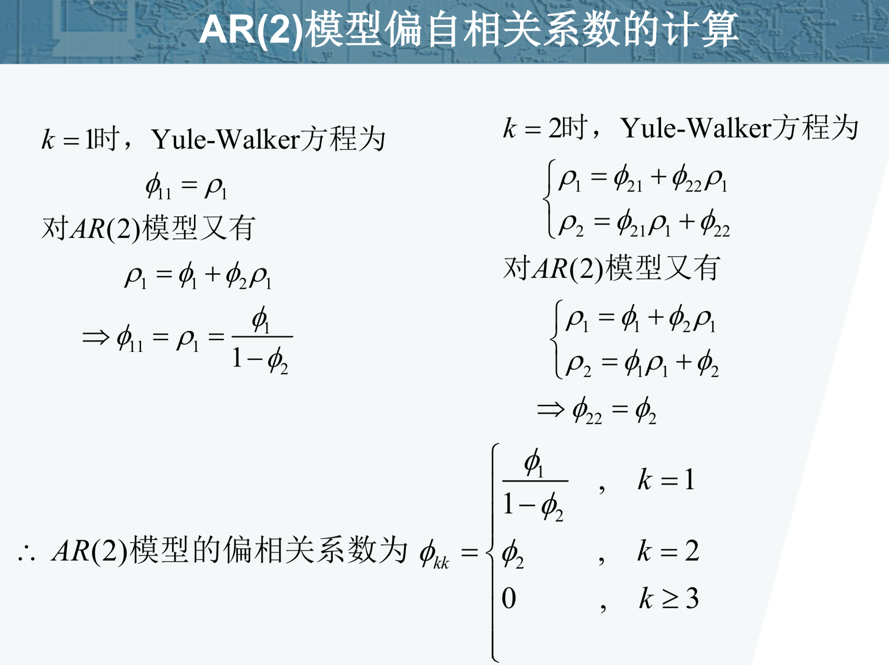

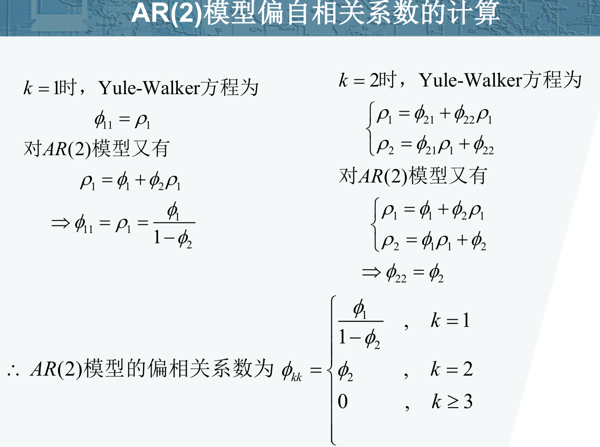

**举例说明**

(1) $x_{t}=0.8 x_{t-1}+\varepsilon_{t}$
(2) $x_{t}=-0.8 x_{t-1}+\varepsilon_{t}$
(3) $x_{t}=x_{t-1}-0.5 x_{t-2}+\varepsilon_{t}$
(4) $x_{t}=-x_{t-1}-0.5 x_{t-2}+\varepsilon_{t}$

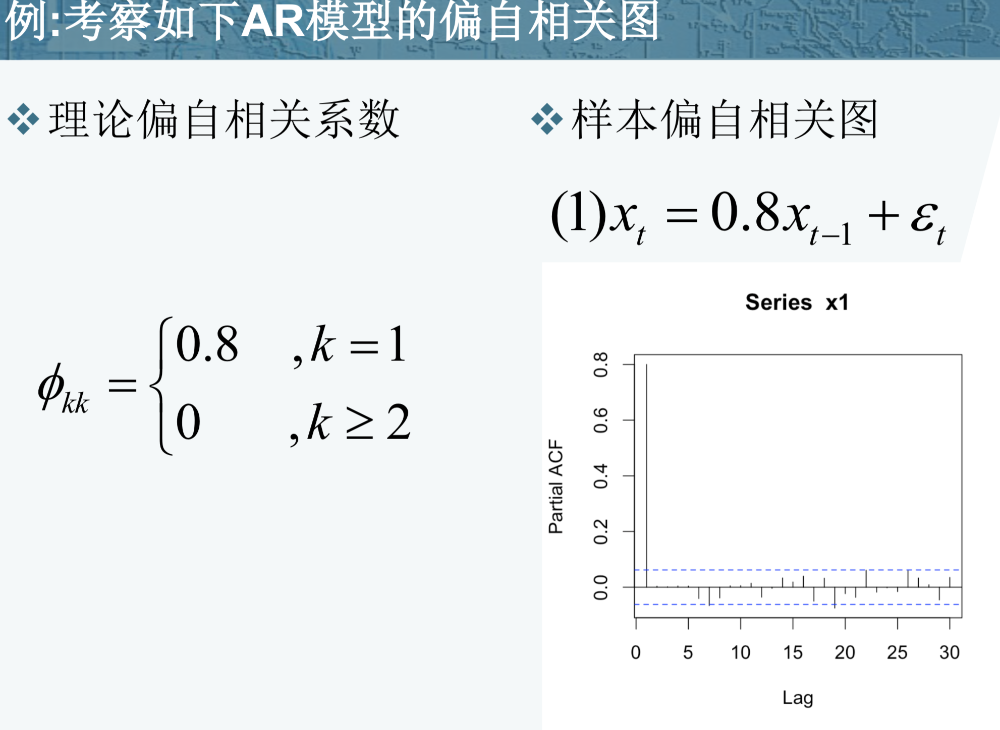

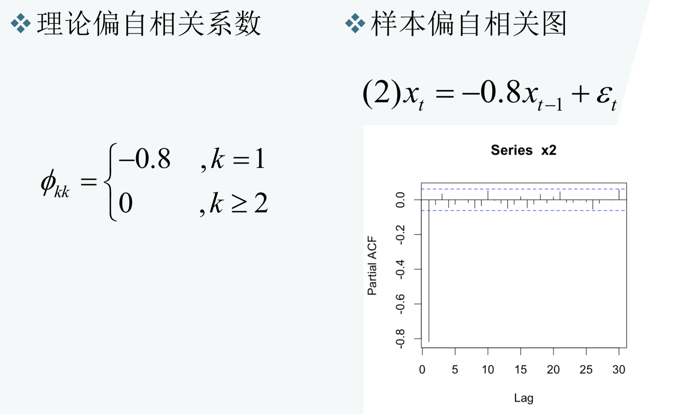

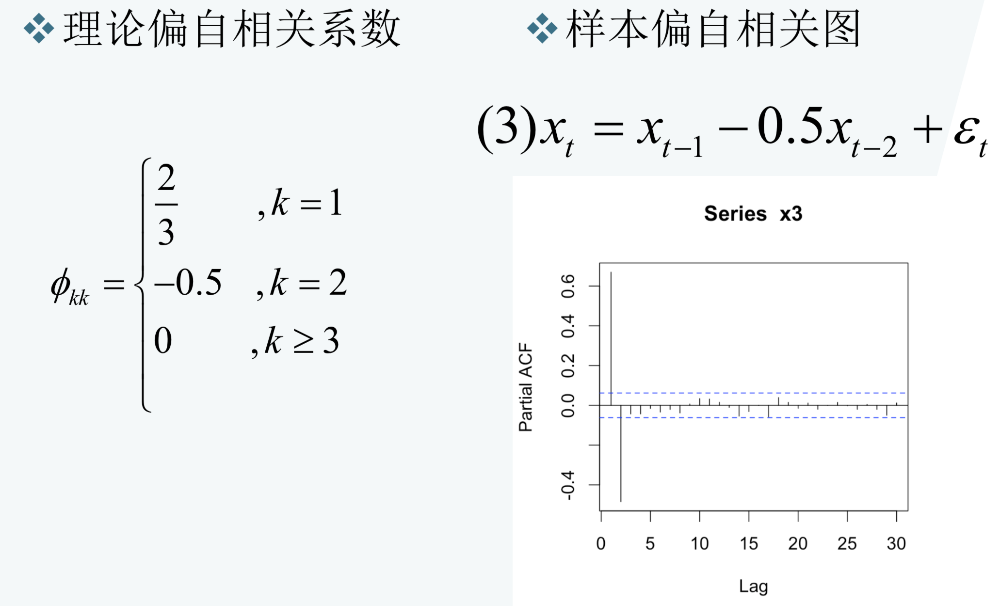

$\phi_{k k}=\left\{\begin{array}{ll}{\frac{\phi_{1}}{1-\phi_{2}}} & {, \quad k=1} \\ {\phi_{2}} & {, \quad k=2} \\ {0} & {, \quad k \geq 3}\end{array}\right.$

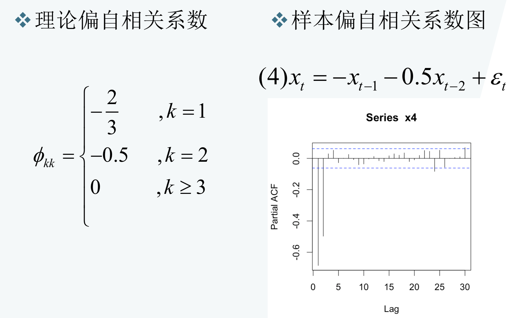

###总结 

* PACF是为了辅助AR(P)模型找出P的值大小

###附录：

###最小二乘法求解参数

​		数理统计中回归分析，用来确定两种或两种以上变量间相互依赖的定量关系的一种统计分析方法，其表达形式为$y=w^TX + b$，b为误差服从均值为0的正态分布，其中只有一个自变量的情况称为简单回归，多个自变量的情况叫多元回归。

$h_\theta(x)=\theta_{1}x_{1}+\theta_{2}x_{2} + \cdot \cdot \cdot \cdot \cdot+\theta_{n}x_{n} = \sum_{i=1}^{n}\theta_{i}x_{i}$

使用矩阵表示：

$\theta_{i \times 1} = [\theta_1,\theta_2,\cdot\cdot\cdot\theta_i]$

$X_{i\times1}=[x_1,x_2,\cdot \cdot \cdot x_i]$

**把上述线性函数写成矩阵相乘的形式**

$\theta^TX=\begin{bmatrix}  \theta_1 \\  \theta_2 \\ \cdot \\ \cdot \\ \cdot \\ \theta_i \end{bmatrix} \cdot [x_1,x_2,\cdot \cdot \cdot x_i] = \sum_{i=1}^{n}\theta_{i}x_{i} $

把上述多项求和的式子，转换成矩阵的乘法的表达式。 由此我们就把多项求和化简为如下表达式：

$h_\theta(x)=\theta^TX$

**误差项的分析:**

原式:y=wx+b 其中b就是我们所说的偏移量，或者叫误差项。

然后我们对应整理成线性回归函数：

$h_\theta(x)=\theta^Tx+\epsilon$

我们根据实际情况，假设认为这个误差项是满足以下几个条件的。

1. 误差$\epsilon_{(i)}$是独立。
2. 具有相同的分布。
3. 服从均值为0方差为$\theta_2$的高斯分布。

误差项是符合高斯分布的，所以误差项的概率值：

$P(\varepsilon_i)=\frac{1}{\sqrt{2\pi}\sigma}e^{-(\frac{(\varepsilon_i)^2}{2\sigma^2})}$

然后把误差值带入式子中:

$P(y_i|x_i,\theta)=\frac{1}{\sqrt{2\pi}\sigma}e^{-(\frac{(y_i-\theta^Tx_i)^2}{2\sigma^2})}$

 

**由概率密度函数得到似然函数:** 

$L(\mu,\sigma^2) = \prod_{i=1}^{N}\frac{1}{\sqrt{2\pi}\sigma}e^{-\frac{(x_i-\mu)^2}{2\sigma^2}}$ 

**最大似然估计 (Maximum Likelihood Estimation)** 

**采用最大似然法，等价于对似然求最大：** 

$\arg max_w L(w)=\prod_{i=1}^{N}\frac{1}{\sqrt{2\pi}\sigma}e^{-(\frac{(y_i-w^Tx_i)^2}{2\sigma^2})}$ 

**得到对数似然：** 

$l(w)=-nlog\sigma\sqrt{2\pi}-\frac{1}{2\sigma^2}\sum_{i=1}^{n}(y_i-w^Tx_i)^2$ 

**通过对数似然进行变换后，因为$-nlog\sigma\sqrt{2\pi}$是定值，所以最终解析解：** 

$arg min_w f(w)=\frac{1}{2\sigma^2}\sum_{i=1}^{n}(y_i-w^Tx_i)^2 =||y-w^TX||_2^2$ 

**注意：上面的解析解就是最小二乘法**

**详解最小二乘法：**$\sum_{i=1}^{N}(y_i-\theta^Tx_i)^2$

​		上述代价函数中使用的均方误差，其实对应了我们常用的欧几里得的距离（欧式距离，**Euclidean Distance**）, 基于均方误差最小化进行模型求解的方法称为“最小二乘法”（**least square method**），即通过最小化误差的平方和寻找数据的最佳函数匹配

​		当函数子变量为一维时，最小二乘法就蜕变成寻找一条直线，然后我们把得到的损失函数推广到n维，转换成矩阵形式

**损失函数：**

$J(\theta)=\sum_{i=1}^{N}(y_i-\theta^Tx_i)^2$

其对应的均方误差表示为如下矩阵

$J(\theta) = {(y-X\theta)^T(y-X\theta)}$

**其中X：**

$X=\begin{bmatrix} 1 && x_1^T  \\ 1 && x_2^T  \\ \cdot \\ \cdot \\ \cdot  \\ 1 && x_N^T \end{bmatrix} =\begin{bmatrix} 1 &&    x_{11} && x_{12}  && \cdot \cdot \cdot  x_{1n}  \\ 1 && x_{21} && x_{22} && \cdot \cdot \cdot x_{2n}   \\ \cdot  \\  \cdot \\ \cdot \\ 1&& x_{m1} && x_{m2}  && \cdot \cdot \cdot x_{mn}  \end{bmatrix} $

对θ求导

$J(\theta) = {(y-X\theta)^T(y-X\theta)}=y^Ty-y^Tx\theta-\theta^Tx^Ty+\theta^Tx^Tx\theta$

$\frac{\partial J(\theta)}{\partial(\theta)} = \frac{\partial y^Ty}{\partial(\theta)} - \frac{\partial y^Tx\theta}{\partial(\theta)} - \frac{\partial \theta^Tx^Ty}{\partial(\theta)} + \frac{\partial \theta^Tx^Tx\theta}{\partial(\theta)} $

$\frac{\partial J(\theta)}{\partial(\theta)} = 0-x^Ty-x^Ty+2x^Tx\theta$

$\frac{\partial J(\theta)}{\partial(\theta)} =2x^T(x\theta-y)$

根据导数的性质，该值在导数为0时为最小

所以：根据微积分定理，令上式等于零，可以得到 θ 最优的闭式解。当

$2(x^Ty-x^Tx\theta)=0$时取得最小

最终结果：	$\theta = (x^Tx)^{-1}x^Ty$