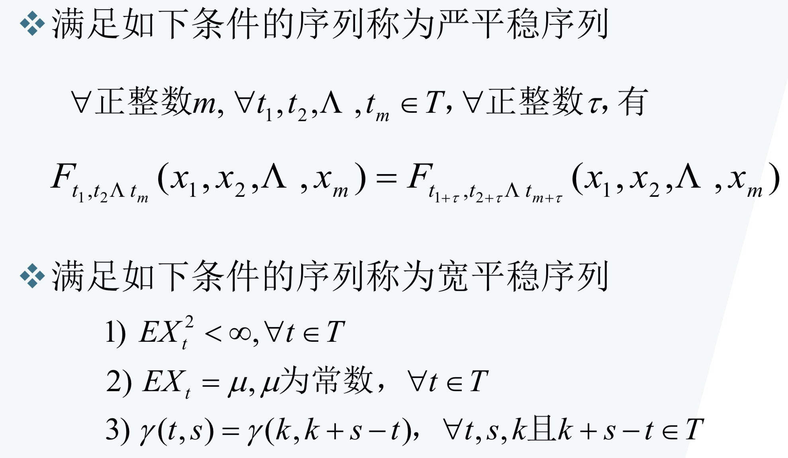
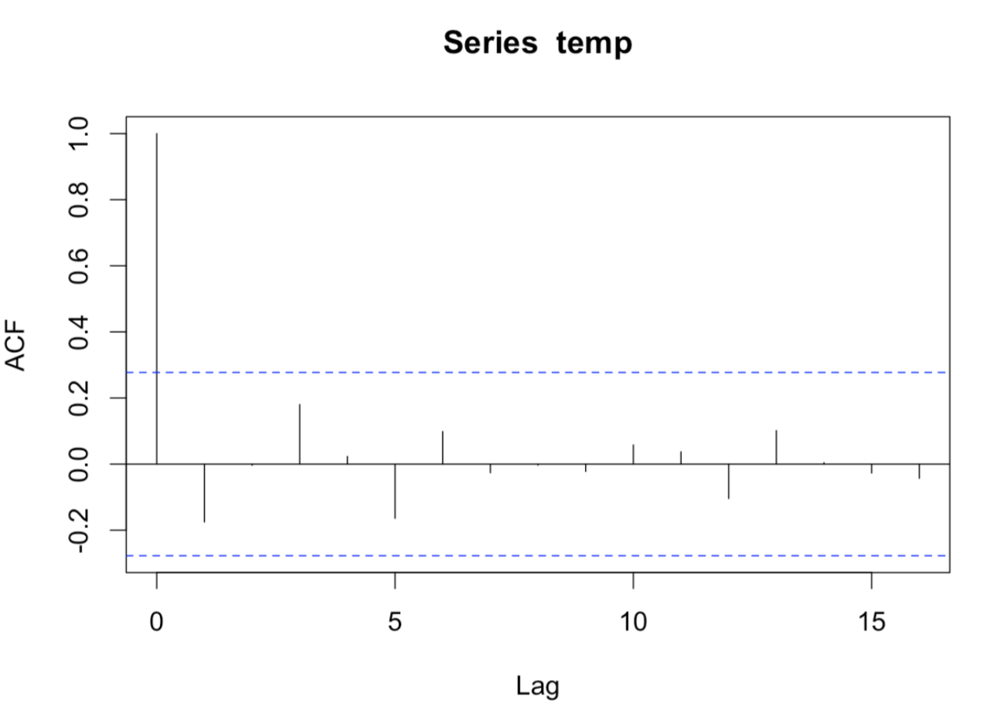
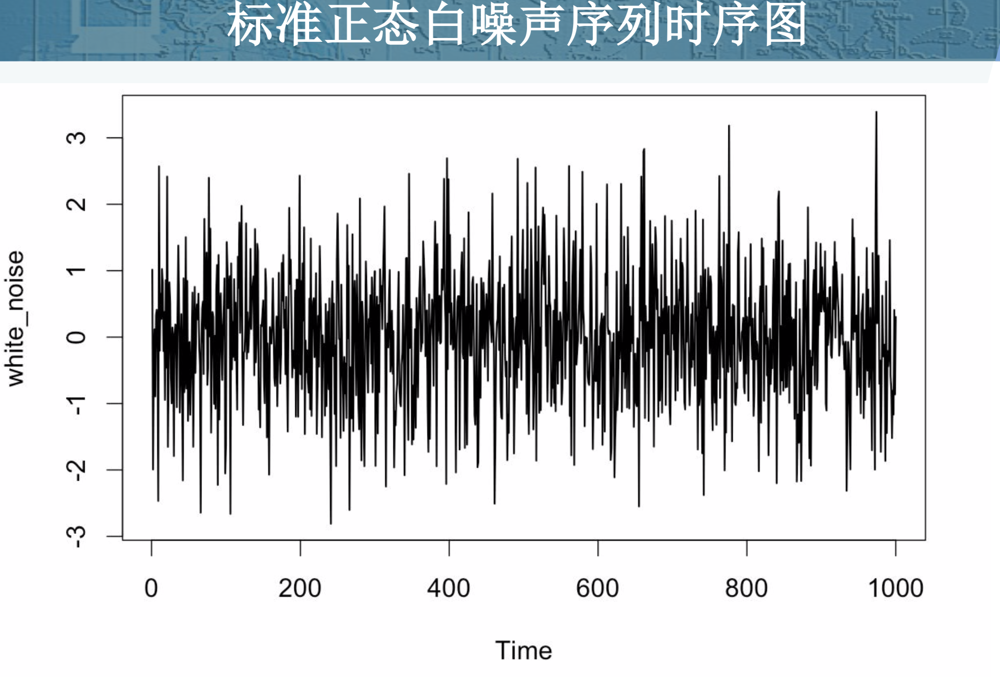
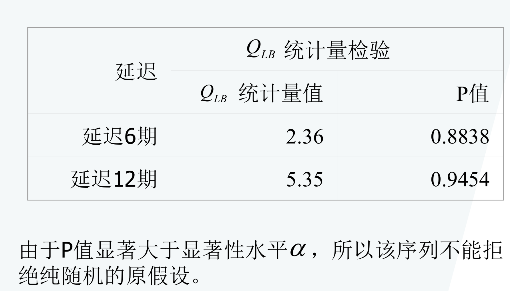

在学习本章之前，先回顾下一定数学概念：

* 期望和均值不同  [期望和均值的区别](https://zhuanlan.zhihu.com/p/34150914)
  * 期望是针对于随机变量而言的一个量，可以理解是一种站在“**上帝视角**”的值。针对于他的样本空间而言的。
  * 均值是一个统计量(对观察样本的统计)，期望是一种概率论概念，是一个数学特征。
  * 如果说概率是频率随样本趋于无穷的极限 ，**期望就是平均数随样本趋于无穷的极限**，可以看出**均值和期**望的联系也是大数定理联系起来的。

**特征统计量**

* 均值：$\mu_{t}=E X_{t}=\int_{-\infty}^{\infty} x d F_{t}(x)$
* 方差：$D X_{t}=E\left(X_{t}-\mu_{t}\right)^{2}=\int_{-\infty}^{\infty}\left(x-\mu_{t}\right)^{2} d F_{t}(x)$
* 自协方差：$\gamma(t, s)=E\left(X_{t}-\mu_{t}\right)\left(X_{s}-\mu_{s}\right)$
* 自相关系数（标准的变化范围 (-1,1)）：$\rho(t, s)=\frac{\gamma(t, s)}{\sqrt{D X_{t} \cdot D X_{s}}}$

**总结：**

* 衡量两个变量的关系一般用自相关系数
* 自相关系数有很多种，工作中常用的是皮尔森相关系数：指的是线性相关系数 $\rho_{X, Y}=\frac{\operatorname{cov}(X, Y)}{\sigma_{X} \sigma_{Y}}=\frac{E\left[\left(X-\mu_{X}\right)\left(Y-\mu_{Y}\right)\right]}{\sigma_{X} \sigma_{Y}}$
* 自协方差把s换成t就是方差

**平稳时间序列定义**

* 严平稳：从概率分布的角度，联合概率分布不会随着时间变化
* 宽平稳：它认 为序列的统计性质主要由它的低阶矩决定，所以只要保证序列低阶矩平稳(二阶)，就能保证序列的主要性质近似稳定。

**为什么需要时间序列的统计性质关于时间平移不变呢？**

因为我们研究时间序列很重要的一个应用（或者出发点），是希望通过时间序列的**历史数据**来得到其**未来的一些预测**。换句话说，我们希望时间序列在**历史数据上的一些性质，在将来保持不变**，这不就是时间平移的不变性么？反过来想，如果时间序列不是平稳的，由历史数据得到的统计性质对未来毫无意义，那么研究时间序列便没有了意义

柯西分布是强平稳，但由于柯西分布期望与方差不存在，所以不是弱平稳。（之所以不存在是因为其并非绝对可积。）

金融资产的价格是随机游走的，这说明我们不能基于金融资产价格进行预测。为了获得平稳的序列，即统计规律不发生大的变化的序列，我们通常差分求金融资产价格的对数收益率，收益率序列一般是通过平稳性检验的，统计特性的规律性较强（比如说尖峰肥尾、负偏、波动集聚（cluster volatility））.。

**平稳性检验方法**

* 时序图检验
  * 根据平稳时间序列的均值，方差为常数的性质，平稳序列的时序图应该显示出该序列始终在一个常数值附近随机波动，而且波动的范围有届，无明显趋势及周期特征
* 自相关图检验
  * 平稳序列通常具有短期相关性。该性质用自相关系数来描述就是随着延迟期数的增加，平稳序列的自相关系数会很快地衰减向零

**非平稳序列的一些表现**

* 有显著的递增趋势特征
* 有明显的趋势和周期特征

如果序列没有明显的趋势和周期特征，需要再看自相关图辅助判断平稳性，如果自相关图显示几乎所有的自相关系数都在**两倍标准差（定义的1.98*标准差，约等于2倍）**范围之内，是典型的短期相关（甚至是不相关）属性，结合是时序图可以判断

该图显示此序列是平稳序列

**自相关图**

- ACF auto-correlation-function  自相关函数

**纯随机序列的定义**

* 纯随机序列也成为白噪声序列，满足以下性质

  (1) $E X_{t}=\mu, \forall t \in T$
  (2) $\gamma(t, s)=\left\{\begin{array}{l}{\sigma^{2}, t=s} \\ {0, t \neq s}\end{array}, \forall t, s \in T\right.$

  

**白噪声序列的性质**

* 纯随机性
  * 各序列值之间没有任何相关关系即为 “没有记忆”的序 列
  *   $\gamma(k)=0, \quad \forall k \neq 0$
* 方差齐性
  * 根据马尔可夫定理，只有方差齐性假定成立时，用最小二乘法得到的未知参数估计值才是准确的、有效的 
  * $D X_{t}=\gamma(0)=\sigma^{2}$

**纯随机性检验原理：Barlett定理**

* 如果一个时间序列是纯随机的，得到一个观察期数为n的观察序列，那么该序列的延迟非零期数为n的观察序列，那么该序列的延迟非零期的样本自相关系数将近似服从均值为零，方差为序列观察期数倒数的正太分布
* $\hat{\rho}_{k} \& N\left(0, \frac{1}{n}\right) \quad, \forall k \neq 0$

**纯随机性检验的假设条件**

* 原假设：延迟期数小于或等于m期的序列值之间相互独立
  * $H_{0}: \rho_{1}=\rho_{2}=\Lambda=\rho_{m}=0, \forall m \geq 1$
* 备择假设：延迟期数小于或等于m期的序列值之间有相关性
  * $H_1$:至少存在某个$\rho_{k} \neq 0, \forall m \geq 1, \quad k \leq m$

**纯随机性检验的检验统计量**

* Q统计量（Box & Pierce）
  * $Q=n \sum_{k=1}^{m} \hat{\rho}_{k}^{2} \sim \chi^{2}(m)$
* LB统计量（Ljung & Box）
  * $L B=n(n+2) \sum_{k=1}^{m}\left(\frac{\hat{\rho}_{k}^{2}}{n-k}\right) \sim \chi^{2}(m)$

**纯随机性检验的判别**

* 拒绝原建设
  * 当检验统计量大于$\chi_{1-\alpha}^{2}(m)$ 分位点，或该统计量的P值小于$\alpha$ 时，则可以以$1-\alpha$的置信水平拒绝原假设，认为该序列为非白噪声序列
* 接受原假设
  * 当检验统计量小于$\chi_{1-\alpha}^{2}(m)$分位点，或该统计量的P值大于$\alpha$时，则认为在$1-\alpha$的置信水平下无法拒绝原假设，即不能显著拒绝序列为纯随机序列的假定

