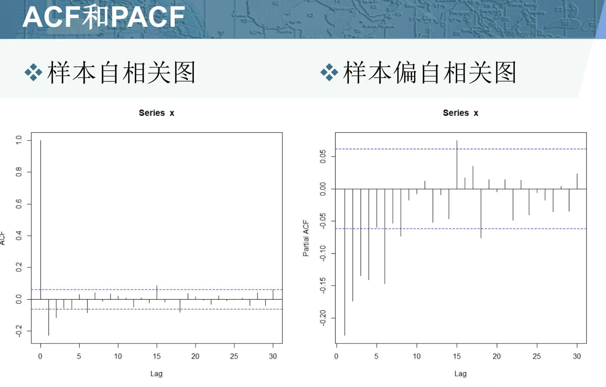

截尾是指时间序列的自相关函数（ACF）或偏自相关函数（PACF）在某阶后均为0的性质（比如AR的PACF）；

拖尾是ACF或PACF并不在某阶后均为0的性质（比如AR的ACF）。

**拖尾**：始终有非零取值，不会在k大于某个常数后就恒等于零(或在0附近随机波动)

**截尾**：在大于某个常数k后快速趋于0为k阶截尾

**AR模型：自相关系数拖尾，偏自相关系数截尾；**

**MA模型：自相关系数截尾，偏自相关函数拖尾；**

**ARMA模型：自相关函数和偏自相关函数均拖尾。**

**ARMA模型的定义**

* 具有如下结构的模型称为自回归移动平均模型  ARMA(p,q)

  $\left\{\begin{array}{l}{x_{t}=\phi_{0}+\phi_{1} x_{t-1}+\mathrm{L}+\phi_{p} x_{t-p}+\varepsilon_{t}-\theta_{1} \varepsilon_{t-1}-\mathrm{L}-\theta_{q} \varepsilon_{t-q}} \\ {\phi_{p} \neq 0, \quad \theta_{q} \neq 0} \\ {E\left(\varepsilon_{t}\right)=0, \quad \operatorname{Var}\left(\varepsilon_{t}\right)=\sigma_{\varepsilon}^{2}, E\left(\varepsilon_{t} \varepsilon_{s}\right)=0, s \neq t} \\ {E\left(x_{s} \varepsilon_{t}\right)=0, \forall s<t}\end{array}\right.$

* 特别当$\phi_{0}=0$时，称为中心化ARMA(p,q)模型

**系数多项式**

* 延迟算子的作用，是为了让模型更简单
* 引进延迟算子，中心化ARMA(p,q)模型可以简记为$\Phi(B) x_{t}=\Theta(B) \varepsilon_{t}$
* p阶自回归系数多项式 $\Phi(B)=1-\phi_{1} B-\phi_{2} B^{2}-\Lambda-\phi_{p} B^{p}$
* q阶移动平均系数多项式 $\Theta(B)=1-\theta_{1} B-\theta_{2} B^{2}-\Lambda-\theta_{q} B^{q}$

移动平均具有滞后性

**平稳条件与可逆条件**

* ARMA(p,q)模型的平稳条件
  * P阶自回归系数多项式 $\Phi(B)=0$ 的根都在单位圆外
  * 即ARMA(p,q)模型的平稳性完全由其自回归部门的平稳性决定
* ARMA(p,q)模型的可逆条件
  * q阶移动平均系数多项$\Theta(B)=0$ 的根都在单位圆外
  * 即ARMA(p,q)模型的可逆性完全由其移动平滑部分的可逆性决定

**传递形式与逆转形式**

* 传递形式 $\begin{aligned} x_{t} &=\Phi^{-1}(B) \Theta(B) \varepsilon_{t} \\ &=\sum_{j=0}^{\infty} G_{j} \varepsilon_{t-j} \end{aligned}$
* 逆转形式 $\begin{aligned} \varepsilon_{t} &=\Theta^{-1}(B) \Phi(B) x_{t} \\ &=\sum_{j=0}^{\infty} I_{j} x_{t-j} \end{aligned}$

**ARMA(p,q)模型的统计性质**

* 均值：$E x_{t}=\frac{\phi_{0}}{1-\phi_{1}-\Lambda-\phi_{p}}$
* 协方差：$\gamma(k)=\sigma_{\varepsilon}^{2} \sum_{i=0}^{\infty} G_{i} G_{i+k}$
* 自相关系数：$\rho(k)=\frac{\gamma(k)}{\gamma(0)}=\frac{\sum_{j=0}^{\infty} G_{j} G_{j+k}}{\sum_{j=0}^{\infty} G_{j}^{2}}$

**ARMA模型的相关性**

* 自相关系数拖尾
* 偏自相关系数拖尾

### 举例说明

**拟合模型ARMA(1,1)**

$x_{t}-0.5 x_{t-1}=\varepsilon_{t}-0.8 \varepsilon_{t-1}$

并直观的考察该模型自相关系数和偏自相关系数的性质

**ARMA模型相关性特征**

| 模型      | 自相关系数 | 偏自相关系数 |
| --------- | ---------- | ------------ |
| AR(P)     | 拖尾       | P阶截尾      |
| MA(q)     | q阶截尾    | 拖尾         |
| ARMA(p,q) | 拖尾       | 拖尾         |

**ARMA阶数判断**

基本思想

* 如果去掉AR部分的影响，残差应该服从MA
* 如何知道AR部分的阶，try p = 1,2,3

找到第一个O，水平线和右对角线都是O，当前值对应着p和q

