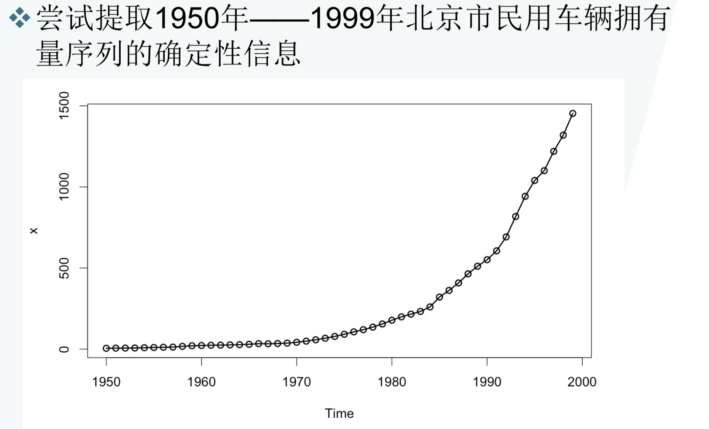
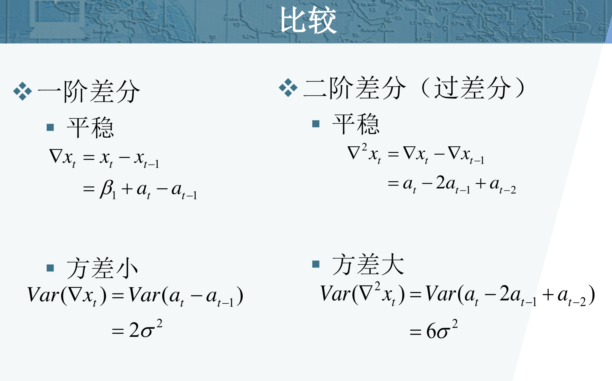
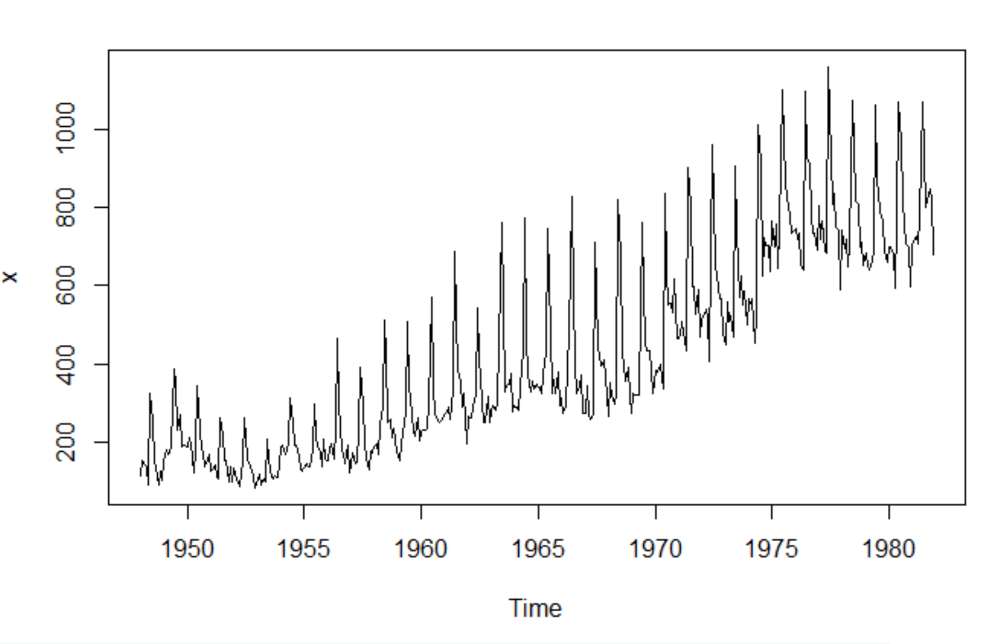

**差分运算**

* 一阶差分 $\nabla x_{t}=x_{t}-x_{t-1}$
* p阶差分  $\nabla^{p} x_{t}=\nabla^{p-1} x_{t}-\nabla^{p-1} x_{t-1}$
* k步差分  $\nabla_{k} x_{t}=x_{t}-x_{t-k}$

**差分方式的选择**

* 差分方法是一种非常简便、有效的确定性信息提取方法
* 序列蕴含着显著的线性趋势，一阶差分就可以实现趋势平稳
* 序列蕴含着曲线趋势，通常低阶（二阶或三阶）差分就可以提取出曲线趋势的影响
* 对于蕴含着固定周期的序列进行步长为周期长度的差分运算，通常可以较好地提取周期信息

【例1】1964年——1999年中国纱年产量序列蕴含 着一个近似线性的递增趋势。对该序列进行一阶 差分运算 

考察差分运算对该序列线性趋势信息的提取作用

$\nabla x_{t}=x_{t}-x_{t-1}$

**过差分**

* 从理论上而言，足够多次的差分运算可以充分地提取原序列中的非平稳确定性信息
* 但是：差分运算的阶数并不是越多越好，因为差分运算是一种对信息的提取，加工过程，每次差分都会有信息的损失
* 在实际应用中差分运算的阶数得适当，应当避免过度差分的现象

**假设序列如下**

$x_{t}=\beta_{0}+\beta_{1} t+a_{t}$
$E\left(a_{t}\right)=0, \operatorname{Var}\left(a_{t}\right)=\sigma^{2}, \operatorname{Cov}\left(a_{t}, a_{t-i}\right)=0, \forall i \geq 1$

**ARIMA模型结构**

* 使用场合：差分平稳序列拟合
* 模型结构：$\left\{\begin{array}{l}{\Phi(B) \nabla^{d} x_{t}=\Theta(B) \varepsilon_{t}} \\ {E\left(\varepsilon_{t}\right)=0, \operatorname{Var}\left(\varepsilon_{t}\right)=\sigma_{\varepsilon}^{2}, E\left(\varepsilon_{t} \varepsilon_{s}\right)=0, s \neq t} \\ {E x_{s} \varepsilon_{t}=0, \forall s<t}\end{array}\right.$
* p,d,q
  * d=0 $\mathrm{ARIMA}(\mathrm{p}, \mathrm{d}, \mathrm{q})=\mathrm{ARMA}(\mathrm{p}, \mathrm{q})$
  * p=0 $\operatorname{ARIMA}(\mathrm{P}, \mathrm{d}, \mathrm{q})=\operatorname{IMA}(\mathrm{d}, \mathrm{q})$
  * q=0 $\mathrm{AR} \operatorname{lM} \mathrm{A}(\mathrm{P}, \mathrm{d}, \mathrm{q})=\mathrm{AR} !(\mathrm{p}, \mathrm{d})$
  * d=1,p=1=0 ARIMA(P,d, q) =random walk model

**随机游走模型(random walk)**

* 模型结构$\left\{\begin{array}{l}{x_{t}=x_{t-1}+\varepsilon_{t}} \\ {E\left(\varepsilon_{t}\right)=0, \operatorname{Var}\left(\varepsilon_{t}\right)=\sigma_{\varepsilon}^{2}, E\left(\varepsilon_{t} \varepsilon_{s}\right)=0, s \neq t} \\ {E x_{s} \varepsilon_{t}=0, \forall s<t}\end{array}\right.$
* 模型使用场合
  * Karl Pearson(1905)在《自然》杂志上提问:假如有个醉汉醉得 非常严重，完全丧失方向感，把他放在荒郊野外，一段时间之后 再去找他，在什么地方找到他的概率最大呢?这个醉汉的行走轨 迹就是一个随机游走模型。 
  * 传统的经济学家普遍认为投机价格的走势类似于随机游走模型， 随机游走模型也是有效市场理论的核心

**ARIMA模型的平稳性**

* ARIMA(p,d,q) 模型共有p+d个特征根，其中p个在单位圆内，d个在单位圆上
* 当 $d \neq 0$ 时，ARIMA(p,d,q)模型非平稳

**ARIMA模型建模步骤**

**举例说明**

**建模**

* 定阶： $\operatorname{ARIMA}(0,1,1)$

* 参数估计：

  $(1-B) x_{t}=4.99661+(1+0.70766 B) \varepsilon_{t}$
  $\operatorname{Var}\left(\varepsilon_{t}\right)=56.48763$

* 模型检验

  

**对中国农业实际国民收入指数序列的预测**

**简单季节模型**

* 简单季节模型是指序列中的季节效应和其他效应之间是加法关系 $x_{t}=S_{t}+T_{t}+I_{t}$
* 简单季节模型通过简单的趋势差分，季节差分之后序列即可转化为平稳，它的模型结构通常如下$\nabla_{D} \nabla^{d} x_{t}=\frac{\Theta(B)}{\Phi(B)} \varepsilon_{t}$

**举例说明** 拟合1962——1991年德国工人季度失业率序列

**差分平稳**

* 对原序列做一阶差分消除趋势，再做4步差分消除季节效应的影响，差分后序列的时序图如下

  

  

  

**模型拟合**

* 定阶: ARIMA((1,4),(1,4),0)

* 参数估计：$(1-B)\left(1-B^{4}\right) x_{t}=\frac{1}{1-0.44746 B+0.28132 B^{4}} \mathcal{E}_{t}$

**模型校验**

**拟合效果图**

**乘积季节模型**

* 使用场合

  * 序列的季节效应、长期趋势效应和随机波动之间有着复杂的相互关联性，简单的季节模型不能充分地提取其中的相关关系

* 构造原理

  * 短期相关性用低阶ARMA(p,q)模型提取

  * 季节相关性用以周期步长S为单位的ARMA(P,Q)模型提取

  * 假设短期相关和季节效应之间具有乘积关系，模型结构如下

    $\nabla^{d} \nabla_{S}^{D} x_{t}=\frac{\Theta(B)}{\Phi(B)} \frac{\Theta_{S}(B)}{\Phi_{S}(B)} \varepsilon_{t}$

  

**拟合1948——1981年美国女性月度失业率序列**

**差分平稳**

一阶、12步差分

**差分后序列自相关图**

**差分后序列偏自相关图**

**简单季节模型拟合效果**

**乘积季节模型拟合**

* 模型定阶：$\operatorname{ARIMA}(1,1,1) \times(0,1,1)_{12}$
* 参数估计：$\nabla \nabla_{12} x_{t}=\frac{1-0.7253 B}{1-0.231 B}\left(1-0.5942 B^{12}\right) \varepsilon_{t}$

**模型检验**

**拟合与预测效果图**

