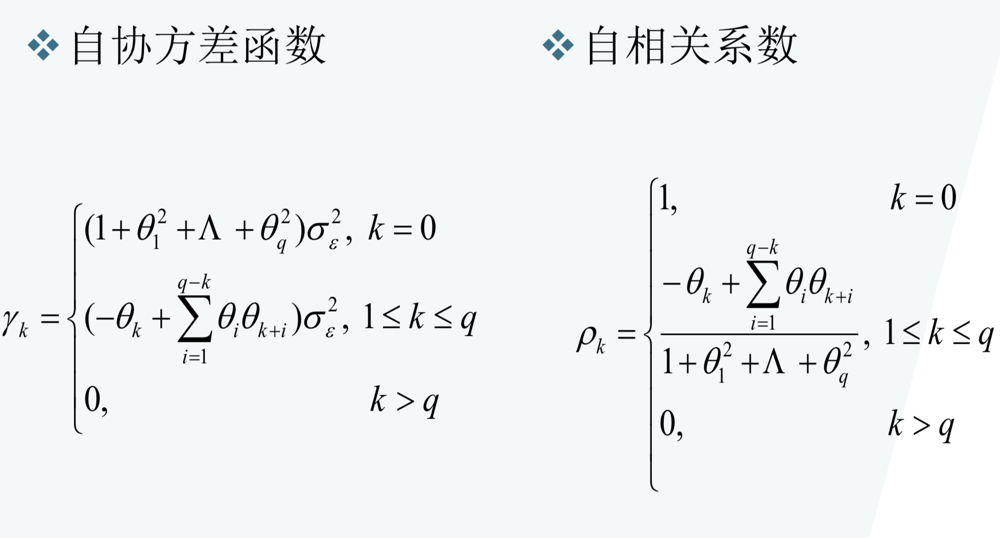
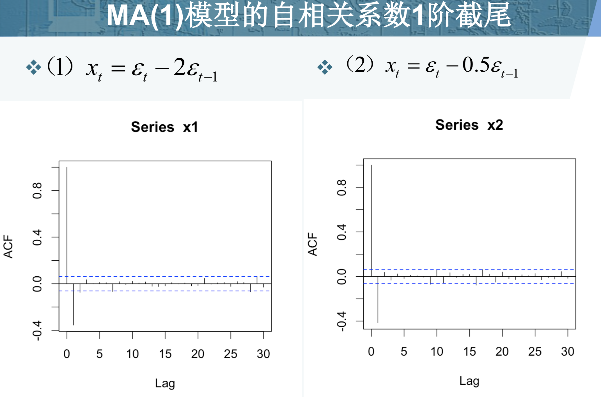
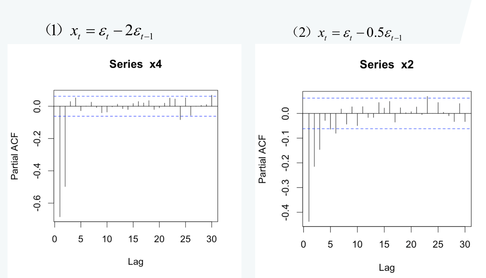

**MA模型**

MA模型和AR大同小异，它并非是历史时序值的线性组合而是历史白噪声的线性组合。与AR最大的不同之处在于，AR模型中历史白噪声的影响是间接影响当前预测值的（通过影响历史时序值）。

[AR、MA及ARMA模型](https://zhuanlan.zhihu.com/p/22248464)

具有如下结构的模型称为q阶自回归模型，简记为MA(q)

$\left\{\begin{array}{l}{x_{t}=\mu+\varepsilon_{t}-\theta_{1} \varepsilon_{t-1}-\theta_{2} \varepsilon_{t-2}-\mathrm{L}-\theta_{q} \varepsilon_{t-q}} \\ {\theta_{q} \neq 0} \\ {E\left(\varepsilon_{t}\right)=0, \quad \operatorname{Var}\left(\varepsilon_{t}\right)=\sigma_{\varepsilon}^{2}, E\left(\varepsilon_{t} \varepsilon_{s}\right)=0, s \neq t}\end{array}\right.$

特别当 $\mu = 0$ 时，称为中心化 MA(q) 模型

**常数均值**

$\begin{aligned} E x_{t} &=E\left(\mu+\varepsilon_{t}-\theta_{1} \varepsilon_{t-1}-\theta_{2} \varepsilon_{t-2}-\Lambda-\theta_{q} \varepsilon_{t-q}\right) \\ &=\mu \end{aligned}$

**常数方差**

$\begin{aligned} \operatorname{Var}\left(x_{t}\right) &=\operatorname{Var}\left(\mu+\varepsilon_{t}-\theta_{1} \varepsilon_{t-1}-\theta_{2} \varepsilon_{t-2}-\Lambda-\theta_{q} \varepsilon_{t-q}\right) \\ &=\left(1+\theta_{1}^{2}+\Lambda+\theta_{q}^{2}\right) \sigma_{\varepsilon}^{2} \end{aligned}$

**MA模型的统计性质**

**MA模型的统计性质**

* MA(q)模型一定是宽平稳的，因为它是有限个白噪声的线性组合
* MA(q)模型的ACF具有q阶截尾的性质

**MA模型的自相关系数**

* MA(1)模型

  $\rho_{k}=\left\{\begin{array}{ll}{1} & {, k=0} \\ {\frac{-\theta_{1}}{1+\theta_{1}^{2}}} & {, k=1} \\ {0} & {, k \geq 2}\end{array}\right.$

* MA(2)模型

  $\rho_{k}=\left\{\begin{array}{cc}{1} & {, k=0} \\ {\frac{-\theta_{1}+\theta_{1} \theta_{2}}{1+\theta_{1}^{2}+\theta_{2}^{2}}} & {, k=1} \\ {\frac{-\theta_{2}}{1+\theta_{1}^{2}+\theta_{2}^{2}}} & {, k=2} \\ {0} & {, k \geq 3}\end{array}\right.$

**MA模型的相关性质**

(1) $x_{t}=\varepsilon_{t}-2 \varepsilon_{t-1}$
(2) $x_{t}=\varepsilon_{t}-0.5 \varepsilon_{t-1}$

**不同的MA(1)模型，相同的自相关系数**

* 通过上面的MA(1)模型的自相关图,可以发现这两个不同的MA模型具有相似的自相关图

* 它们的理论自相关系数也正好相等

  $\rho_{k}=\left\{\begin{array}{ll}{-0.4,} & {k=1} \\ {0} & {, k \geq 2}\end{array}\right.$

* 自相关系数有可能不唯一

**MA模型的可逆性**

* 这种自相关系数的不唯一性，会给我们将来的工作增加麻烦。
* 因为将来我们都是通过样本自相关系数显示出来的特征选择合适的模型拟合序列的发展，如果自相关系数和模型之间不是一一对 应关系，就将**导致拟合模型和随机序列之间不会是一一对应关系**。为了保证一个给定的自相关函数能够对应唯一的模型，我们就要给模型增加约束条件。这个约束条件称为模型的可逆性条件。 

**MA(q)模型 可以变成AR(p）模型**

**可逆的定义**

* 若一个MA模型能够表示成收敛的AR模型形式，那么该MA模型称为可逆MA模型
* 一个自相关系数列唯一对应一个可逆的MA模型

延迟算子类似于一个时间指针，当前序列值乘以一个延迟算子，就相当于把当前序列值的时间向过去拨了一个时刻
记B为延迟算子，有

$x_{t-1}=B x_{t}$
$x_{t-2}=B^{2} x_{t}$
$\quad \mathrm{M}$
$x_{t-p}=B^{p} x_{t}, \forall p \geq 1$

**延迟算子的性质**

$B^{0}=1$
$B\left(c \cdot x_{t}\right)=c \cdot B\left(x_{t}\right)=c \cdot x_{t-1},$  c为任意常数
$B\left(x_{t} \pm y_{t}\right)=x_{t-1} \pm y_{t-1}$
$B^{n} x_{t}=x_{t-n}$
$(1-B)^{n}=\sum_{i=0}^{n}(-1)^{i} C_{n}^{i} B^{i} \quad, \quad 其中 C_{n}^{i}=\frac{n !}{i !(n-i) !}$

延迟算子的引入让模型表示的更简单

**MA模型的可逆条件**

* MA模型q阶移动平均系数多项式

  $\Theta(B)=1-\theta_{1} B-\theta_{2} B^{2}-\Lambda-\theta_{q} B^{q}$

* MA(q)模型的可逆条件是：移动平均系数多项式的根都在**单位圆外**

* MA模型的可逆条件和AR模型的平稳条件是完全对偶的

**举例：MA模型的可逆性**

(1) $x_{t}=\varepsilon_{t}-2 \varepsilon_{t-1}$
(2) $x_{t}=\varepsilon_{t}-0.5 \varepsilon_{t-1}$

$x_{t}=\varepsilon_{t}-2 \varepsilon_{t-1} \Rightarrow|\theta|=2>1 \Rightarrow$ 不可逆

$x_{t}=\varepsilon_{t}-0.5 \varepsilon_{t-1} \Rightarrow|\theta|=0.5<1 \Rightarrow$ 可逆

**MA模型偏自相关系数拖尾**

* 对于一个可逆MA(q)模型，可以等价写成$AR (\infty)$  模型形式
* AR(p)模型偏自相关系数p阶截尾，所以可逆MA(q)模型偏自相关系数拖尾
* 一个可逆MA(q)模型一定对应着一个与它具有相同自相关系数和偏自相关系数的不可逆MA(q)模型，这个不可逆MA(q)模型也线同样具有偏自相关系数拖尾特性

### MA(1)模型偏自相关系数拖尾

**AR or MA**

* 观察序列的自相关系数，如果有低阶截尾现象，则考虑用MA模型，如果有高阶拖尾现象，则考虑用AR模型
* 观察序列的偏自相关系数，如果有低阶截尾现象，则考虑用AR模型，如果有高阶拖尾现象，则考虑用MA模型

### 总结

* MA模型不可以直接预测，所以要求MA模型的可逆性，这样就可以转换为AR模型，这样就可以使用观测数据，然后求出$\epsilon$,,在根据$\epsilon$ 求出$\phi$  这样MA模型就可以做预测了
* 延迟算子的作用，是为了让MA或AR模型更简单